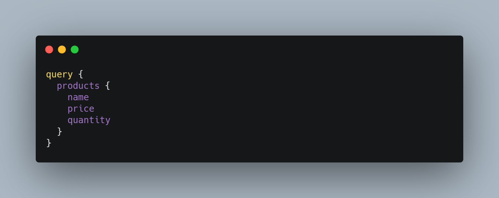

# desafio-ecommerce

Nesse projeto foi desenvolvida uma GraphQL API com Django responsável por uma pequena parte do fluxo de um *ecommerce* com o cadastro de clientes, produtos e usuários.

## Utilização

Para utilização deste projeto, deve-se seguir os seguintes passos:

Clonar o repositório
    
    git clone https://github.com/SilvaIgorDosSantos/desafio-ecommerce
    cd desafio-ecommerce

Instalar os pacotes listados em **requirements.txt**. Eles podem ser instalados via pip:

    pip intall -r requirements.txt

Realizar a migração da base de dados:

    python manage.py makemigrations
    python manage.py migrate

E por último, para executar o servidor localmente:

    python manage.py runserver

## Queries

As seguintes queries foram desenvolvidas para obter os dados referentes ao clientes, produtos e ordens.

### customer

Query que retorna os dados do cliente a partir do token do cliente que deve ser mandado no header da requisição POST, no campo **Authorization**, precedido pelas letras JWT.

    query {
	    customer {
		    CustomerType
		}
	}

### products

Query que retorna os dados de todos os produtos cadastrados. Essa query apresenta filtro no nome dos produtos e no preço.

    query {
	    products(nameSearch: String, minPrice: Float, maxPrice: Float) {
		    ProductType
		}
	}

### customerOrders

Query que retorna os dados das ordens de um cliente a partir do token enviado pelo header.

    query {
	    customerOrders {
		    OrderType
		}
	}

### orderById

Query que retorna os dados de uma ordem a partir do id de uma ordem.

    query {
	    orderById {
		    OrderType
		}
	}

## Mutations

As seguintes mutations foram desenvolvidas para criar clientes, produtos e ordens. Em todas as mutations era retornada a variável **ok** para validar a operação e, em caso de erro, a string **error** com a mensagem de erro.

### createCustomer

Mutation para criar um novo cliente que requer os campos username, email e password e que retorna o token desse novo cliente. Nessa mutation, antes de criar um novo cliente, é verificado se não há outro cliente com o mesmo email já cadastrado.

    mutation {
	    createCustomer(CustomerInput!) {
		    token
		    ok
		    error
		}
	}

### createProduct

Mutation para criar um novo produto que requer os campos name, price e quantity. Nessa mutation, antes de criar um novo produto, é verificado se não há outro produto com o mesmo nome já cadastrado.

    mutation {
	    createProduct(ProductInput!) {
		    ok
		    error
		}
	}

### createOrder

Mutation para criar uma nova ordem que requer os campo de id do cliente e um array com o id dos produtos e a quantidade desejada. Nessa mutation, antes de criar uma nova ordem, é verificado se existe usuário com o id fornecido, e se todos os ids de produtos também representam produtos cadastrados.
Não foi desenvolvido mas seria possível também a validação referente a presença do produto em estoque para impedir ordens com maior quantidade do que ao estoque.

    mutation {
	    createOrder(OrderInput!) {
		    ok
		    error
		}
	}

## Heroku

Foi feito o *deploy* deste projeto no **Heroku** e é possível fazer as queries e mutation [aqui](https://secure-caverns-02969.herokuapp.com/graphql/).

## Exemplos

Estes são alguns exemplos de queries e mutations possíveis:

### Exemplo 1

Resposta:

### Exemplo 2

Resposta:

### Exemplo 3

Resposta:

### Exemplo 4

Resposta:

E query relativa a última mutation:

Resposta:
